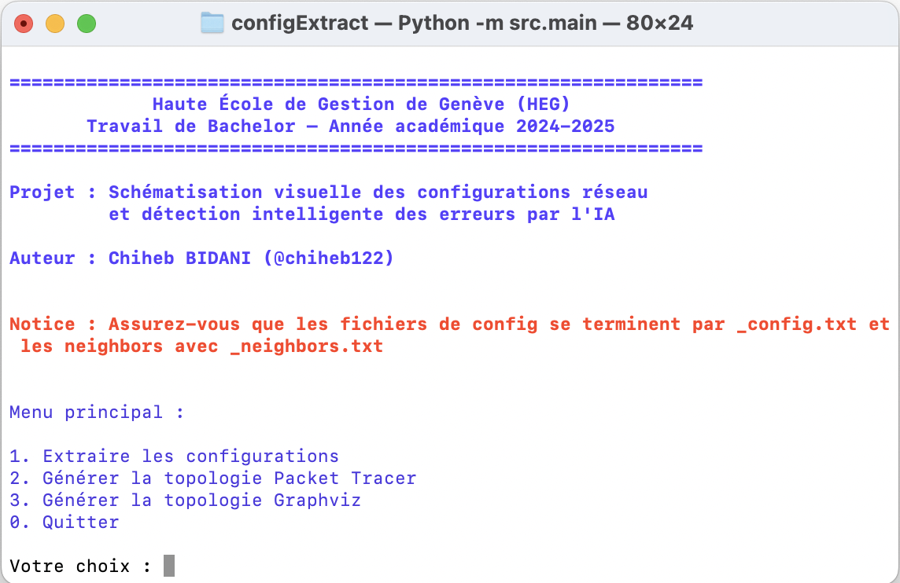

# Bachelor – Sémantisation visuelle des configurations réseau et detection intelligente des erreurs par l'IA

Ce projet a été réalisé dans le cadre de mon travail de Bachelor. Il vise à automatiser la création de topologies réseau dans Cisco Packet Tracer ou Graphviz à partir des fichiers de configuration au format JSON.


---
## 🎯 Objectif

- Générer automatiquement une topologie réseau (routeurs, switches, connexions) dans Packet Tracer
- Proposer une solution portable fonctionnant sur toute machine avec Packet Tracer installé

## 🛠️ Technologies

- Python 3
- Cisco Packet Tracer 8.2.2
- [Graphviz](https://graphviz.org/) installé côté système (pour l’exécutable `dot`)
```bash
dot -V
```

## 📁 Structure du projet

```
configExtract/
├── configs/                   
│   └── extract/
│       └── pytermi.py # Fichiers responsable d'extraction des configs
│   └── save/
│       └── save_configs_to_mongo.py # Enregistrer en mongoDB
|    └── parser_config.py  # Parsing des configs et CDP
|
├── IA/
│   └── llm/ # Modèle llm (ollama,Mistral)
│       └── config_analyzer.py 
│       └── prompt_template.txt
│   └── training/ # Modèle local avec la régression
│       └── config_feature_parser.py 
│       └── train_naive_bayes.py
│       └── dataset.csv 
|
├── models/                   # Modèles Python : Device, Router, Switch, Interface, Link, etc.
│   ├── Device.py
│   ├── Router.py
│   ├── Switch.py
│   ├── Interface.py
│   ├── Link.py
│   └── factory/
│       └── DeviceFactory.py
├── resources/
│   └── xml/                  # Templates XML pour Packet Tracer
│       ├── empty.xml
│       ├── router.xml
│       ├── switch.xml
│       └── link.xml
├── topologie/
│   ├── graphviz/
│   │   └── draw_network.py  
│   └── packet_tracer/
│       └── pkt2xml.py        # Encrypte et décrypte les fichiers 
│       └── PktBuilder.py     # Génération du fichier XML final
├── main.py                   # Script principal
├── app.py                    # Point d'entré dans le scripte
├── docker-compose.yml                   
├── Dockerfile                    
└── README.md                 # Documentation
```

## 🚀 Installation

### 1. Cloner le projet
```bash
git clone https://github.com/chiheb122/bachelor-autoconfig-shematisation
cd nomDeDossier
```

### 2. Installer les dépendances Python
```bash
python3 -m venv venv
# LINUX
source venv/bin/activate  # (ou .venv/bin/activate selon votre config)
# WINDOWS
.venv\Scripts\activate

pip install -r requirements.txt
```

### 3. Compiler la librairie native pka2xml_py (pour Packet Tracer)
```bash
cd lib/pka2xml_py
chmod +x build.sh post_build.sh
./post_build.sh
cd ../../
```
> ⚠️ **Notice** : Après compilation, le script `post_build.sh` détecte automatiquement le nom du fichier compilé et le copie/renomme pour que l'import Python fonctionne, que vous soyez sous Linux ou macOS.  
> Si besoin, adaptez le chemin et le nom selon votre OS et version de Python.

#### Pour Windows :
Utilisez simplement Docker Compose :
```bash
docker-compose up --build
```
L'application sera accessible dans le conteneur, sans compilation manuelle.

### 4. Lancer l'application
```bash
python src/app.py
# ou
python -m src.main
```

---

## 📄 Licence

Ce projet est sous licence MIT.  
Le fichier `LICENSE` est présent à la racine du dépôt.  

---

> ℹ️ **Notice** : Le dossier src/data/config contient un exemple complet des fichiers de configuration extraits ainsi que les topologies générées (Packet Tracer et Graphviz).  
